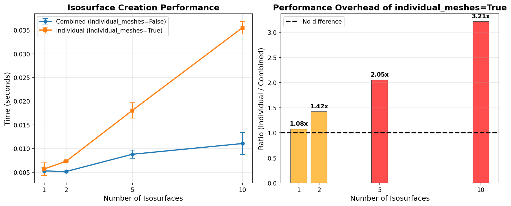

# Benchmark Results: `individual_meshes` Parameter Performance

## Summary

This benchmark tests the performance impact of the `individual_meshes` argument in `PVContourSpec` when creating isosurface visualizations.

**Key Finding:** The `individual_meshes=True` option has significant overhead that **increases linearly** with the number of isosurfaces.

## Performance Results

Test Configuration:
- Grid size: 40×40×25 (40,000 points)
- 5 runs per configuration
- Temperature field with realistic variations

| N Isosurfaces | Combined (s) | Individual (s) | Ratio (Individual/Combined) |
|--------------|-------------|----------------|---------------------------|
| 1            | 0.0053      | 0.0057         | 1.08x (8% slower)        |
| 2            | 0.0052      | 0.0073         | 1.42x (42% slower)       |
| 5            | 0.0088      | 0.0180         | 2.05x (105% slower)      |
| 10           | 0.0111      | 0.0355         | 3.21x (221% slower)      |

**Average Ratio:** 1.94x (94% slower with `individual_meshes=True`)

**Correlation:** 0.999 between number of isosurfaces and performance degradation



## Analysis

### When `individual_meshes=True`

**Behavior:**
- Creates a separate mesh object for each isosurface value
- Results in N mesh objects for N isosurfaces
- Each isosurface is computed via a separate call to PyVista's `contour()` method

**Performance Characteristics:**
- For 1 isosurface: Roughly equivalent (1.08x) - minimal overhead
- For 2+ isosurfaces: Progressively slower as count increases
- At 10 isosurfaces: 3.2x slower than combined approach

**Why the Overhead?**
The overhead comes from:
1. Multiple separate contour operations (N calls vs 1 call)
2. Multiple mesh object creation and management
3. Potentially redundant data structure operations for each mesh

### When `individual_meshes=False` (default)

**Behavior:**
- Creates a single mesh containing all isosurfaces
- Single call to PyVista's `contour()` with multiple isosurface values
- More efficient internal processing of the volume data

**Performance Characteristics:**
- Scales well with number of isosurfaces
- Roughly constant overhead regardless of isosurface count
- Recommended for most use cases

## Recommendations

### Use `individual_meshes=False` (default) when:
- ✅ You need to visualize multiple isosurfaces
- ✅ Performance is important
- ✅ You don't need to manipulate individual isosurfaces separately
- ✅ All isosurfaces use the same styling/opacity

### Use `individual_meshes=True` only when:
- ⚠️ You need separate control over each isosurface (different colors, opacities, etc.)
- ⚠️ You need to show/hide individual isosurfaces dynamically
- ⚠️ You need to export individual isosurfaces to separate files
- ⚠️ Working with ≤3 isosurfaces (overhead is acceptable)

**Note:** For >5 isosurfaces, the overhead becomes substantial (>2x slower). Consider whether individual control is truly necessary.

## Running the Benchmark

### Standalone execution:
```bash
python tests/benchmark_individual_meshes.py
```

### With pytest:
```bash
# Run all benchmark tests
pytest tests/benchmark_individual_meshes.py -v

# Run detailed comparison
pytest tests/benchmark_individual_meshes.py::TestIndividualMeshesPerformance::test_benchmark_comparison_detailed -v -s

# Run parametrized tests
pytest tests/benchmark_individual_meshes.py::TestIndividualMeshesPerformance::test_benchmark_varying_isosurfaces -v
```

## Technical Details

The benchmark measures:
- Mesh creation time (including PyVista contour operations)
- Time to add meshes to the plotter
- Complete rendering pipeline

Test grid characteristics:
- 3D temperature field with sinusoidal variation
- Realistic value ranges (260-310K)
- Added noise for realistic isosurface complexity

Timing methodology:
- `time.perf_counter()` for high-resolution timing
- Multiple runs to account for variability
- Reports mean, std, min, and max times

## Code Location

- Benchmark implementation: `tests/benchmark_individual_meshes.py`
- Parameter definition: `pvplotting/types_pvplotting.py:79`
- Splitting logic: `pvplotting/types_pvplotting.py:196-217`
